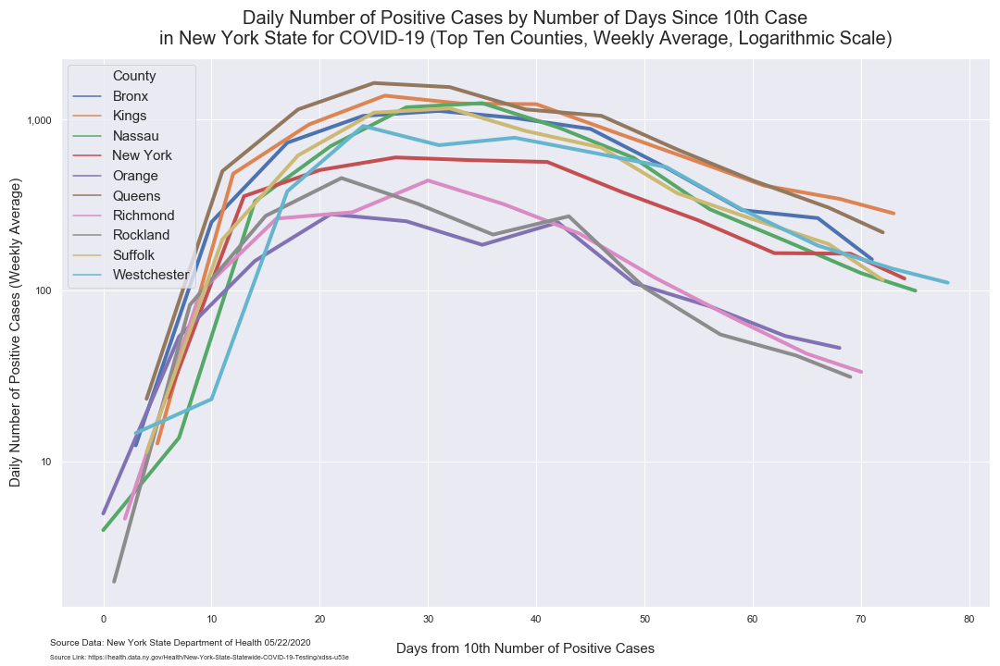
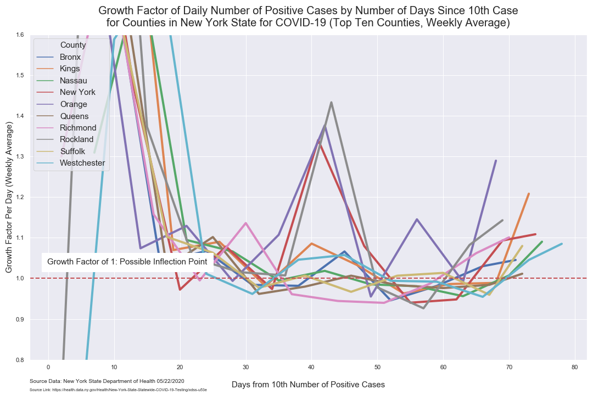
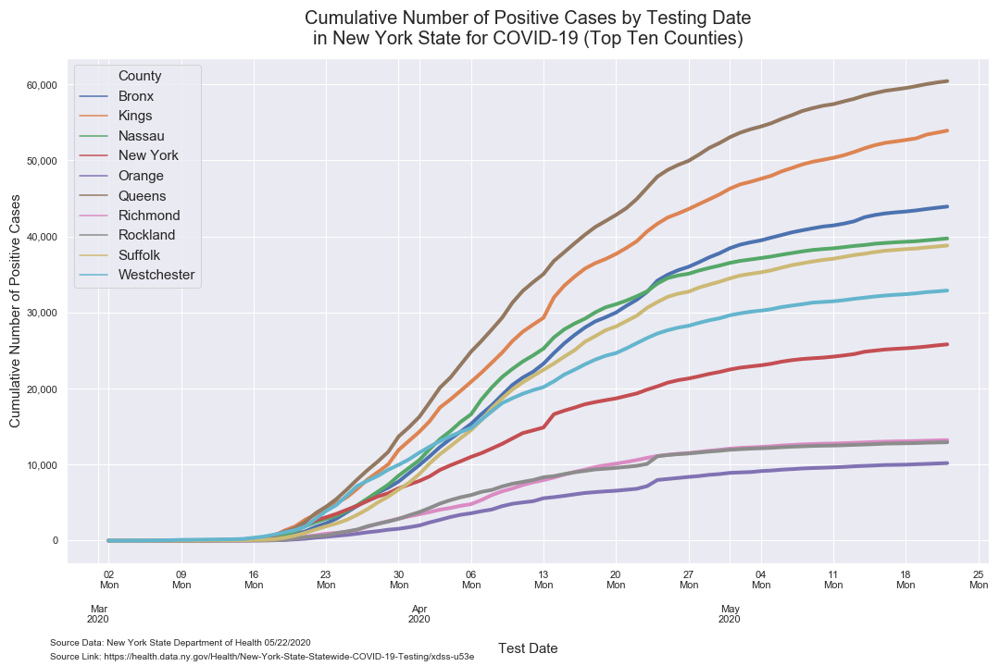

# Analysis of COVID-19 Data for New York State

*Author: Mark Bauer*  
*Date Created: April 4, 2020*  
*Date Updated: April 4, 2020*

Data Provided by: New York State Department of Health.  
New York State Statewide COVID-19 Testing Data Repository:  
https://health.data.ny.gov/Health/New-York-State-Statewide-COVID-19-Testing/xdss-u53e.     

Data Description: *This dataset includes information on the number of tests of individuals for COVID-19 infection performed in New York State beginning March 1, 2020, when the first case of COVID-19 was identified in the state. The primary goal of publishing this dataset is to provide users timely information about local disease spread and reporting of positive cases. The data will be updated daily, reflecting tests completed by 12:00 am (midnight) the day of the update (i.e., all tests completed by the end of the day on the day before the update).*

# Tables

**Table 1. Cumulative Number of Positives in New York State (Top 10 Counties)**

|| County| New Positives| Cumulative Number of Positives|Total Number of Tests Performed| Cumulative Number of Tests Performed|
|---:|:------------|----------------:|---------------------------------:|----------------------------------:|----------------:|
|  0 | Queens      | 1,899           | 18,167                           | 3,048                             | 32,000                                 |
|  1 | Kings       | 1,396           | 15,700                           | 2,512                             | 30,372                                 |
|  2 | Westchester | 784             | 12,351                           | 1,632                             | 40,713                                 |
|  3 | Nassau      | 1,437           | 12,024                           | 2,663                             | 26,971                                 |
|  4 | Bronx       | 1,159           | 11,086                           | 1,946                             | 21,857                                 |
|  5 | Suffolk     | 1,408           | 10,154                           | 2,575                             | 24,028                                 |
|  6 | New York    | 609             | 8,452                            | 1,294                             | 20,893                                 |
|  7 | Rockland    | 538             | 4,289                            | 997                               | 10,108                                 |
|  8 | Richmond    | 287             | 3,754                            | 563                               | 8,282                                  |
|  9 | Orange      | 404             | 2,397                            | 1,114                             | 6,866  

# Figures

## Bar Charts

  

##  Positives Per Day (Weekly Average) by Number of Days Since 10th Positive Case
### Top 10 Counties with Number of Positives Cases

 

##  Growth Factor of Positives Per Day by Number of Days Since 10th Positive Case
### Top 10 Counties with Number of Positives Cases

##  Cumulative Positives by Number of Days Since 10th Positive Case
### Top 10 Counties with Number of Positives Cases

### All Counties in New York State

  

## Trajectory of Positive Cases
### Top 10 Counties with Number of Positives Cases

### All Counties in New York State

### New York State
  

## Time Series
### Top 10 Counties with Number of Positives Cases

### All Counties in New York State

